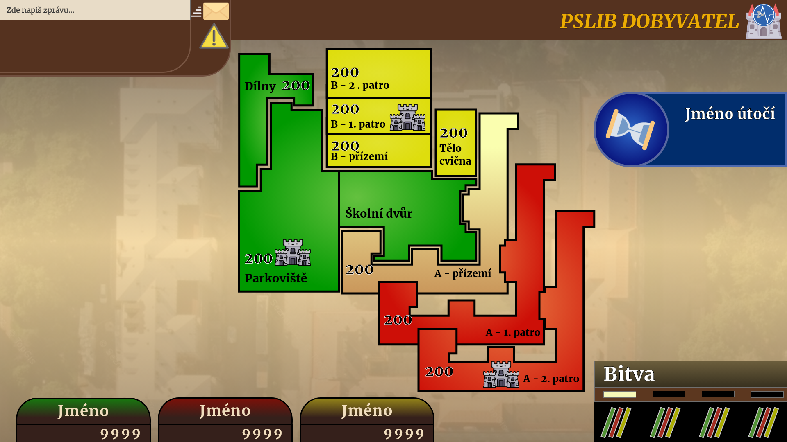

# PSLIB DOBYVATEL

## Popis hry
Tato hra funguje přesně jako klasický Dobyvatel, který si určitě pamatujete z dětství. 
Hra Dobyvatel původně spadala pod TV Nova, ale někde před rokem nebo víc byla původní online PC webová verze stažena a nahradila jí (podle mého názoru) horší verze ve formě mobilní aplikace.

Tu je možné si vyzkoušet zde: https://triviador.com/#cz 

Jinak se dají už najít pouze stará videa na YouTube zachycující tento kus české internetové historie.

## O tomto projektu
### Popis
Tento projekt je v podstatě Dobyvatel akorát napasovaný na naší skvělou školu. Místo otázek z obecných témat jsou zde otázky o škole okolí (celkově hlavně Liberec). Další změnou je herní plán, který představuje mapku školy, která je rozdělená na jednotlivé části, patra budovy A, budovy B, dílny, tělocvična, dílny a další…

### Jak hra funguje
Ve zkratce, dobyvatel funguje tak, že hrajete proti několika dalším hráčům a odpovídáte na různé kvízové otázky. Za správné odpovědi potom získáte body a území na herní mapě v podobě jednotlivých krajů ČR. Nakonec vyhrává ten, kdo získá nejvíce bodů a obsadí největší území ČR. To samé platí pro naší verzi.

### Provedení
Původně jsem to zamýšlel jako webovou hru, jako byl dobyvatel původně, ale samozřejmě je možné udělat i mobilní aplikaci případě desktopovou hru. Volba řešení je asi na vás. Každopádně někdo by určitě ocenil aplikaci v Reactu s použitím Styled Components ;) Pro lepší orientaci jsem vytvořil mockup v Adobe XD, ve kterém se dají vyexportovat jednotlivé části designu případě okopírovat barvy atd.

Co se týče přihlášení, nemyslím si že je nutné. Podle mě by stačilo pouze nějaká volba nicku. Kdyby se pak přihlášení přidávalo dalo by se napojit přes OAuth na Office365 školní účty.

## Design
### Fonty
V mockupu je primárně použit Google Font Merriweather, a to konkrétně ve velikostech 24, 28, 32, 36 a 48px. Používám většinou bold písmo, ale někde se objeví i normální tloušťka.

### Ikony
Do podkladů jsem přiložil všechny ikony, které používám a to jak ve velké velikosti, tak už přímo zmenšené.

### Paleta barev
Hlavní barvy hráčů jsou červená, zelená a žlutá. Často také po vzoru dobyvatele používám gradinty.

Světlejší verze hráčských barev:
+  `#CD0F07` 
+  `#009900` 
+  `#DEDD0D` 

+  `#E97C43` 
+  `#64C13F`
+  `#E2E22C`  

Tmavší verze hráčských barev:
+  `#177C0F` 
+  `#801008` 
+  `#998919` 

Barvy na mapě a v UI:
+  `#552D22` 
+  `#894437` 
+  `#F7F9B9` 
+  `#F1DEBE` 
+  `#000000` 
+  `#707070` 

## Otázky

Tyhle otázky byly vytvoření pro kvízy na školním Instagramu v letech 2020-2021. Podle mě je jde lehko přeformulovat a vytvořit z nich otázky pro PSLIB Dobyvatele. Pokud by bylo potřeba vytvořit ještě více otázek, tak jsem do podkladů přiložil Word dokument, kde je inspirace z dalších příspěvků na PSLIB Instagram účtu, kam se dávaly různé zajímavosti o škole a Liberci. Příklady otázek: (Správná odpověď je vždy tučně)

Víte, V jakém roce byl Liberec hostitelem mistrovství světa v klasickém lyžování?
- **a)	2009**
- b)	2011
- c)	2008
- d)	2012

Víte, V jakém roce se jel první ročník Jizerské padesátky?
- a)	1978
- b)	1970
- c)	1999
- **d)	1968**

Víte, kolik celkem sjezdových tratí se nachází v skiareálu Ještěd?
- a)	10
- b)	7
- **c)	12**
- d)	11

Kdy byl slavnostně otevřen Ještěd?
- **a) 1973** 
- b) 1966
- c) 1968
- d) 1990

Kdy byla první písemná zmínka o Liberci? 
- **a) 1352** 	
- b) 1577 
- c) 1549 
- d) 1545

Kdo byl archtitektem liberecké radnice?
- a) Franz Liebig
- b) Karel Shücker
- c) Antonio Spazio di Lancio
- **d) Franz Neumann**

Jaký je nejvyšší vrchol Jizerských hor?
- a)	Smrk
- b)	Jizera
- **c)	Wysoka Kopa**
- d)	Sněžka

Kdy byla založena liberecká ZOO? (je nejstarší v ČR) 
- **a)	1904**
- b)	1895
- c)	1907
- d)	1919

V jaké sezoně extraligy se stali Bílí Tygři Liberec mistry ČR?
- a)	2006/2007
- b)	2016/2017
- c)	2018/2019
- d)	2015/2016

Jak zní latinský nápis nad hlavním vchodem školy? 
- **a) viribus unitis**
- b) cogito ergo sum 
- c) ante portam inferam 
- d) historia magistra vitae 

V jakém roce absolvoval na PSLIB známý automobilový konstruktér Ferdinand Porsche? 
- a) 1891 
- b) 1900 
- **c) 1893** 
- d) 1895 

Kdo byl prvním ředitelem SPŠSE? 
- a) Hans Hartl 
- b) Franz Richter 
- c) Paul Artmann 
- **d) Gustav Martin Wunder** 

Kdy byla založena Liberecká ZOO? ( Nejstarší v ČR) 
- **a) 1904** 
- b) 1895 
- c) 1907 
- d) 1919

Víte, v jakém roce byla naše škola založena?
- A)	1873
- **B)	1876**
- C)	1879
- D)	Já jsem jí založil loool

